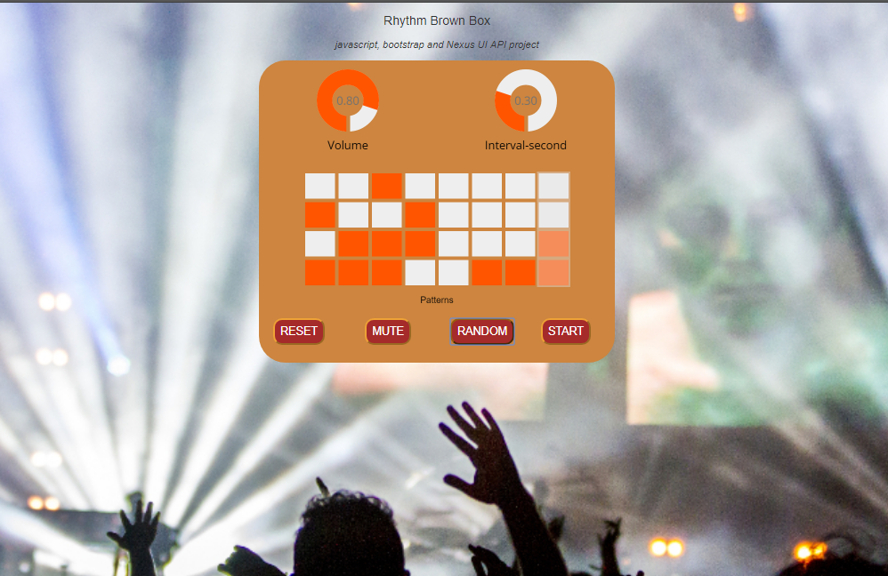

# RHYTHM BROWN BOX - html, css, js, api 

Using the Nexus UI API and [WebAudio API](https://www.w3.org/TR/webaudio/) , this project explores the ability to create beats or sounds using the browser and programming random beats or controlled via UI. This project can be viewed [here](https://portfolio.dmsx.tech/portfolioentries/currentprojects/rhythmbrownbox/)

## Screenshots:

## Usage

Buttons: 
1. Reset: clears-off the toggled-on rhythm grid squares
2. Mute: sets volume to zero
3. Random: randomly toggles-on the squares of the rhythm grid
4. Start: for IOS, automatic play is off so this start button is needed
